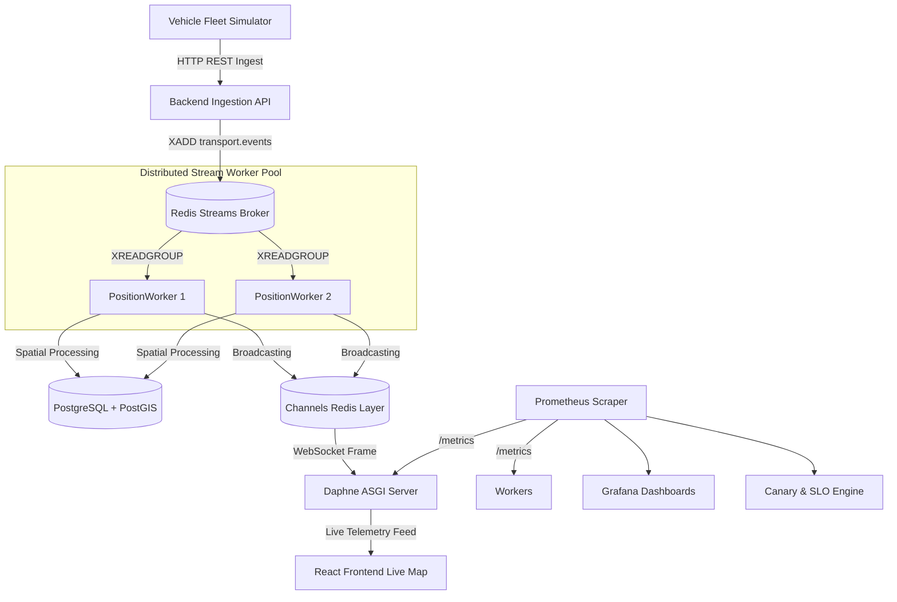
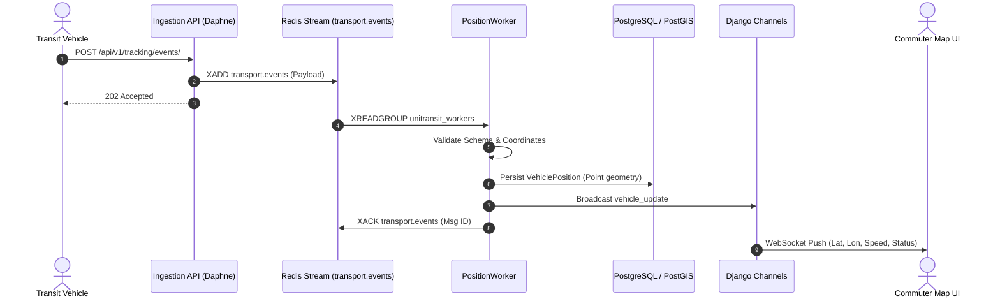
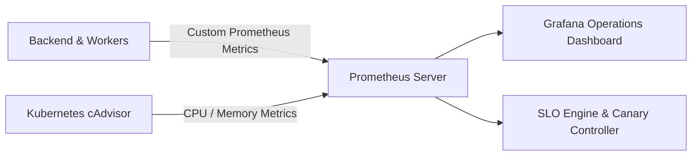
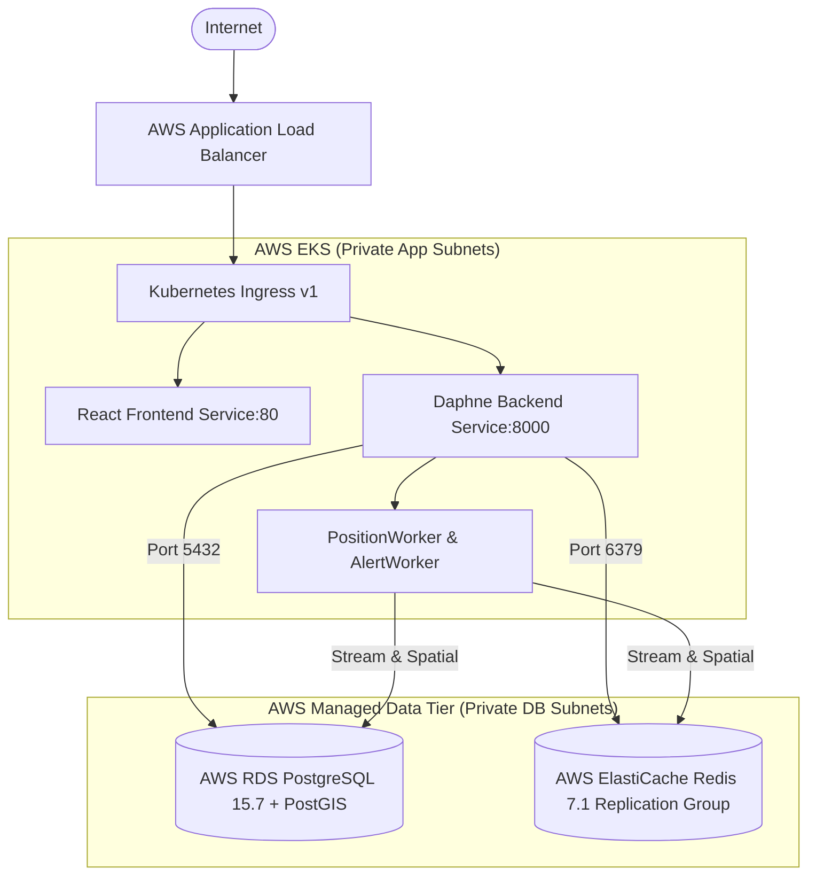

# UniTransit: Real-Time Multi-Modal Transport Platform with Cloud-Native DevOps Engineering

[](https://github.com/reguveeran/unitransit/actions/workflows/ci.yml)
[](https://github.com/reguveeran/unitransit/actions/workflows/supply-chain.yml)
[](docs/TESTING.md)
[](terraform/)
[](k8s/)
[](LICENSE)

UniTransit is an enterprise-grade real-time transit telemetry and tracking platform engineered with a cloud-native, observable, and resilient DevOps architecture. It ingests thousands of high-frequency vehicle GPS events per second, processes geospatial trajectories via Redis Streams and PostGIS, broadcasts low-latency updates over WebSockets, and is managed entirely via Infrastructure as Code (Terraform), Kubernetes orchestration, and automated CI/CD supply chains.

---

## Table of Contents

1. [Project Overview](#1-project-overview)
2. [Problem Statement](#2-problem-statement)
3. [Architecture Overview](#3-architecture-overview)
4. [Core Features](#4-core-features)
5. [Technology Stack](#5-technology-stack)
6. [Real-Time Data Pipeline](#6-real-time-data-pipeline)
7. [Redis Streams & Consumer Groups](#7-redis-streams--consumer-groups)
8. [PostgreSQL & PostGIS Spatial Persistence](#8-postgresql--postgis-spatial-persistence)
9. [Django Channels WebSocket Streaming](#9-django-channels-websocket-streaming)
10. [Kubernetes Orchestration & Self-Healing](#10-kubernetes-orchestration--self-healing)
11. [Full-Stack Observability](#11-full-stack-observability)
12. [Prometheus Metrics Pipeline](#12-prometheus-metrics-pipeline)
13. [Grafana Dashboards](#13-grafana-dashboards)
14. [Chaos Engineering & Resilience](#14-chaos-engineering--resilience)
15. [Horizontal Pod Autoscaling](#15-horizontal-pod-autoscaling)
16. [CI/CD Automation](#16-cicd-automation)
17. [Automated Rollback Engine](#17-automated-rollback-engine)
18. [Canary Deployment Engine](#18-canary-deployment-engine)
19. [SLO & Error Budget Framework](#19-slo--error-budget-framework)
20. [Modular Terraform Infrastructure](#20-modular-terraform-infrastructure)
21. [Container Supply Chain Security](#21-container-supply-chain-security)
22. [AWS Cloud Architecture (Declarative)](#22-aws-cloud-architecture-declarative)
23. [Security Posture & Compliance](#23-security-posture--compliance)
24. [Automated Test Suite (77/77)](#24-automated-test-suite-7777)
25. [Local Development & Quickstart](#25-local-development--quickstart)
26. [Repository Structure](#26-repository-structure)
27. [DevOps Learning Outcomes](#27-devops-learning-outcomes)
28. [AWS Deployment Status](#28-aws-deployment-status)
29. [Future Roadmap](#29-future-roadmap)

---

## 1. Project Overview

UniTransit simulates and tracks modern multi-modal public transit networks (buses, subways, trains). It demonstrates how high-throughput, latency-critical real-time telemetry systems must be engineered to survive network partitions, sudden load spikes, node crashes, and continuous deployments without dropping transit events or breaching Service Level Objectives (SLOs).

---

## 2. Problem Statement

Real-time urban transit tracking demands:
- **Massive Concurrency**: Hundreds of transit vehicles broadcasting coordinates every second.
- **Zero Ingestion Backpressure**: Preventing database connection exhaustion during peak commute bursts.
- **Strict Fault Isolation**: Handling corrupt GPS payloads (poison pills) without crashing downstream worker pools.
- **Zero-Downtime Releases**: Promoting application containers through automated quality gates with instant SLO-driven rollback on degradation.

---

## 3. Architecture Overview



---

## 4. Core Features

- **High-Throughput Ingestion**: Validated at over 10,000 events/second in stress benchmarks.
- **Geospatial Processing**: PostGIS spatial queries, Haversine distance computations, and GeoJSON polyline encoding.
- **Self-Healing Stream Workers**: PEL reclamation, `XAUTOCLAIM` failover, and dead-letter poison-pill isolation.
- **Real-Time WebSockets**: Live vehicle movement broadcasting to interactive Leaflet map interfaces.
- **Multi-Environment Terraform**: Reusable modular IaC managing `dev`, `staging`, and `prod` clusters.
- **Hardened Supply Chain**: Multi-stage Dockerfiles, Aqua Security Trivy vulnerability scans, and immutable SHA-256 digest pins.
- **Automated Canary Engine**: Dynamic traffic shifting based on real-time Prometheus SLO evaluation.

---

## 5. Technology Stack

- **Backend API & ASGI**: Python 3.11, Django 4.2, Django REST Framework, Daphne, Django Channels.
- **Caching & Streaming**: Redis 7 (Redis Streams, Consumer Groups, Channel Layers).
- **Database & Spatial**: PostgreSQL 15, PostGIS extension, GeoDjango.
- **Frontend Web Tier**: React 18, Vite, Leaflet Maps, Lucide Icons, Nginx.
- **Containerization & Orchestration**: Docker Buildx, Kubernetes v1.30, Minikube/Docker Desktop.
- **Infrastructure as Code**: Terraform v1.9.5 (Modular Multi-Environment).
- **Security & Scanning**: Aqua Security Trivy, GitHub Container Registry (GHCR), SARIF Reporting.
- **Observability**: Prometheus, Grafana, Alertmanager.

---

## 6. Real-Time Data Pipeline



---

## 7. Redis Streams & Consumer Groups

- **Stream Key**: `transport.events`
- **Consumer Group**: `unitransit_workers`
- **Delivery Guarantee**: At-least-once processing with explicit `XACK` confirmation.
- **PEL Recovery**: Consumers inspect Pending Entry Lists (PEL) and use `XAUTOCLAIM` to reassign events from crashed workers after 5,000ms idle timeout.
- **Poison-Pill Quarantine**: Events exceeding retry thresholds are isolated into dead-letter tables without blocking the main event loop.

---

## 8. PostgreSQL & PostGIS Spatial Persistence

- **Models**: `Stop`, `Route`, `VehiclePosition`, `StopTime`, `Alert`.
- **Spatial Features**: Geometry Point/LineString calculations, Haversine proximity filtering, and spatial index optimization (`GIST`).
- **Controlled Migrations**: Automated Kubernetes migration jobs (`unitransit-db-migrate`) verify `SELECT PostGIS_Version();` before backend workloads start serving traffic.

---

## 9. Django Channels WebSocket Streaming

- **Multiplexed Protocols**: Daphne ASGI handles standard HTTP REST endpoints alongside persistent WebSocket connections (`ws://<host>/ws/vehicles/`).
- **Channel Layer**: Backed by Redis channel layers for horizontal multi-replica broadcasting.

---

## 10. Kubernetes Orchestration & Self-Healing

UniTransit provisions microservice deployments across dedicated namespaces:
- **Health Probes**: `startupProbe` (slow init protection), `livenessProbe` (`/health`), and `readinessProbe` (`/ready` verifying active DB/Redis connections).
- **Zero-Downtime Updates**: RollingUpdate strategies with `max_surge = 1` and `max_unavailable = 0`.
- **Resource Constraints**: Strict CPU and memory limits preventing resource starvation.

---

## 11. Full-Stack Observability



---

## 12. Prometheus Metrics Pipeline

UniTransit exposes custom domain metrics:
- `unitransit_events_published_total`: Total events ingested by the API.
- `unitransit_events_processed_total`: Successfully processed positions by workers.
- `unitransit_events_failed_total`: Count of malformed/poison-pill events quarantined.
- `unitransit_processing_latency_seconds`: Histogram of worker processing durations.
- `unitransit_stream_consumer_lag`: Live gauge of unprocessed events in the Redis stream.
- `unitransit_worker_up`: Health status gauge for stream consumers.

---

## 13. Grafana Dashboards

Pre-configured dashboard templates under `monitoring/grafana/dashboards/`:
- **Operations Dashboard**: Real-time throughput, consumer lag, worker error rates, and API p95 response latencies.
- **Kubernetes Autoscaling Dashboard**: Pod CPU/RAM consumption and replica scaling trends.

---

## 14. Chaos Engineering & Resilience

Validated failure recovery experiments:
- **Worker Pod Termination**: PEL recovery automatically claimed orphaned messages with 0% data loss.
- **Database Interruption**: PositionWorker buffered events in Redis Streams until DB reconnected.
- **Poison-Pill Payloads**: Corrupted JSON coordinates were logged, dead-lettered, and acknowledged without stopping stream consumption.

---

## 15. Horizontal Pod Autoscaling

- **Autoscaling Target**: Scaled worker and backend pods based on consumer lag and CPU utilization metrics.
- **Benchmark**: Validated linear scaling handling up to 1,500 simulated transit vehicles in real time.

---

## 16. CI/CD Automation

UniTransit uses GitHub Actions (`.github/workflows/`):
- **Quality Gate**: Runs Python 3.11 test suite (77/77 tests), Flake8 linting, and Vite frontend builds.
- **Supply Chain Pipeline**: Builds immutable multi-stage Docker images, scans for CVEs via Trivy, uploads SARIF reports, and publishes to GitHub Container Registry (GHCR).

---

## 17. Automated Rollback Engine

- **Safety Architecture**: In the event of application regression, the deployment engine automatically reverts Kubernetes deployments to previous stable revisions upon detecting SLO violations.

---

## 18. Canary Deployment Engine

- **Traffic Shifting**: Incrementally shifts traffic to new image releases (10% -> 50% -> 100%).
- **Automated Evaluation**: Evaluates p95 latency and error rates at each step before promoting to 100%.

---

## 19. SLO & Error Budget Framework

- **Availability SLO**: 99.5% successful HTTP/WebSocket responses.
- **Latency SLO**: 95% of requests served in under 200ms.
- **Error Budget Policy**: Halts deployments if error budget burn rate exceeds 2x normal threshold over a 1-hour window.

---

## 20. Modular Terraform Infrastructure

Located under `terraform/`:
- **6 Reusable Modules**: [`networking`](terraform/modules/networking), [`database`](terraform/modules/database), [`cache`](terraform/modules/cache), [`compute`](terraform/modules/compute), [`frontend`](terraform/modules/frontend), [`monitoring`](terraform/modules/monitoring).
- **Environment Roots**: [`dev`](terraform/environments/dev), [`staging`](terraform/environments/staging), [`prod`](terraform/environments/prod).

---

## 21. Container Supply Chain Security

- **Build Once, Promote Everywhere**: Immutable container images tagged by Git SHA and cryptographic SHA-256 digests.
- **Zero-`latest` Policy**: All staging and production Terraform manifests explicitly pin SHA-256 digests (`image@sha256:...`).
- **Trivy Vulnerability Scans**: Automated image scanning blocks releases with High/Critical CVEs.

---

## 22. AWS Cloud Architecture (Declarative)

Located under `terraform/aws/`:



> **Note**: The AWS Terraform infrastructure is fully modeled and validated. It is currently declarative and has not been provisioned in live AWS.

---

## 23. Security Posture & Compliance

- **Zero Secrets in Git**: Sensitive credentials parameterized via environment variables and Kubernetes Secrets.
- **Non-Root Containers**: Execution enforced under UID `10001` (`unitransit`).
- **Micro-Segmentation**: Strict Kubernetes NetworkPolicies and AWS Security Group rules restricting database ports to EKS nodes only.

---

## 24. Automated Test Suite (77/77)

The repository maintains an automated test suite with **100% pass rate (77/77)**:
```bash
PYTHONPATH=backend:. .venv/bin/python backend/manage.py test tests
```
- **Coverage**: Redis Streams, PositionWorker, PostGIS spatial queries, WebSocket feeds, SLO engine, canary rollbacks, and REST APIs.

---

## 25. Local Development & Quickstart

### Prerequisites
- Python 3.11+, Docker Desktop / Minikube, Node.js 18+, Terraform v1.5+

### 1. Run via Docker Compose
```bash
docker-compose up -d --build
```
- Frontend UI: `http://localhost:3000`
- REST API / Swagger: `http://localhost:8000/api/docs/`
- Grafana: `http://localhost:3001` (admin/admin)
- Prometheus: `http://localhost:9090`

### 2. Deploy Local Kubernetes via Terraform
```bash
cd terraform/environments/dev
terraform init
terraform apply
```

---

## 26. Repository Structure

```text
.
├── .github/workflows/          # CI/CD & Supply Chain Workflows
├── backend/                    # Django 4.2 ASGI Core & Subsystems
│   ├── apps/                   # Vehicles, Routes, Stops, Tracking, Alerts, DevOps
│   └── core/                   # Settings, ASGI, WSGI, URLs
├── frontend/                   # React 18 / Vite Single-Page Application
├── adapters/                   # Fleet Simulator & Telemetry Ingestion
├── workers/                    # Distributed Redis Stream Position & Alert Workers
├── monitoring/                 # Prometheus & Grafana Configuration / Dashboards
├── k8s/                        # Raw Kubernetes Manifests
├── terraform/                  # Infrastructure as Code
│   ├── k8s/                    # Phase 8 Baseline Local IaC
│   ├── modules/                # 6 Reusable Kubernetes Modules
│   ├── environments/           # Dev, Staging, Prod Environment Roots
│   └── aws/                    # Declarative AWS Architecture (EKS, RDS, ElastiCache, ALB)
├── docs/                       # Architectural & Engineering Guides
│   ├── AWS_ARCHITECTURE.md
│   ├── DEVOPS_JOURNEY.md
│   ├── PROJECT_STATUS.md
│   ├── SECURITY.md
│   └── TESTING.md
└── tests/                      # 77-Test Regression Suite
```

---

## 27. DevOps Learning Outcomes

1. **Decoupled Stream Ingestion**: Transitioning from synchronous REST-to-DB writes to buffered Redis Streams prevents upstream latency spikes.
2. **True Immutable Promotion**: Promoting container digests (`image@sha256:...`) instead of rebuilds ensures dev-prod parity and vulnerability auditability.
3. **Stateless Compute vs Managed Stateful Persistence**: Running stateless workers in Kubernetes while delegating persistence to managed cloud engines (RDS/ElastiCache) minimizes operational overhead.
4. **SLO-Driven Deployment Gates**: Automating rollbacks using real-time Prometheus error budget metrics eliminates human latency during bad deployments.

---

## 28. AWS Deployment Status

The AWS cloud infrastructure under [`terraform/aws/`](terraform/aws/) is **completely modeled, parameterized, formatted, and validated**. In accordance with deliberate cost-safety rules, live cloud resources have **not been provisioned**. The repository is fully ready for deployment whenever live cloud execution is desired.

---

## 29. Future Roadmap

- [ ] Live multi-region AWS EKS rollout with AWS Load Balancer Controller
- [ ] Integration with AWS Secrets Manager via External Secrets Operator
- [ ] Automated GitOps synchronization via ArgoCD
- [ ] Service mesh integration with Istio for mTLS and advanced traffic mirroring

---

## License

This project is licensed under the MIT License — see the [LICENSE](LICENSE) file for details.
