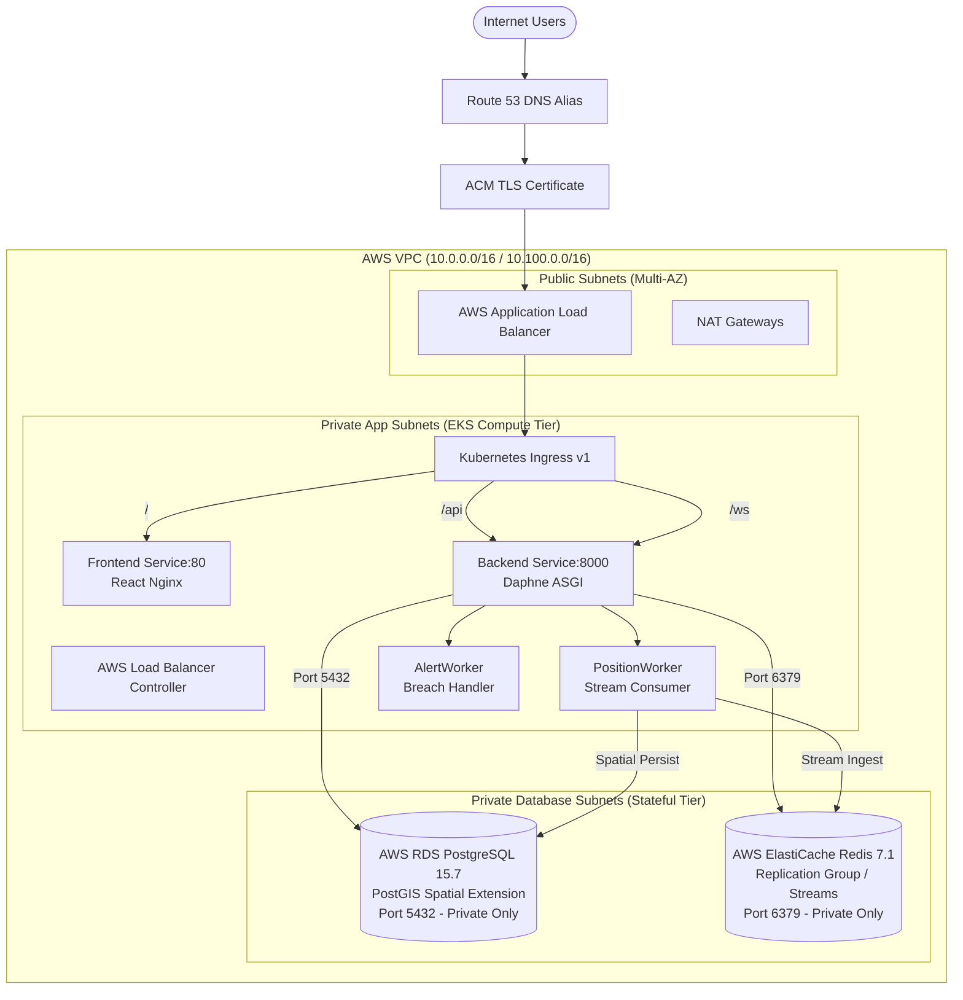

# UniTransit AWS Cloud Architecture & Infrastructure Guide

> **IMPORTANT ARCHITECTURAL NOTICE**:  
> The AWS Cloud Infrastructure described in this document and implemented under `terraform/aws/` represents a **complete, declarative Terraform model**.  
> **No live AWS infrastructure is currently running or provisioned**. All cost figures and sizing specifications represent pre-deployment engineering estimates.

---

## 1. Architectural Progression

```text
Phase 9.1: Modular Multi-Environment Terraform Architecture (dev, staging, prod)    ✅
Phase 9.2: Container Supply Chain Security (Buildx, Trivy, GHCR, SHA-256 Digests)     ✅
Phase 9.3A: AWS VPC, Multi-AZ Subnetting, Security Groups & IAM Roles                ✅
Phase 9.3B: AWS EKS Control Plane & Managed Node Groups Architecture                 ✅
Phase 9.3C: AWS RDS PostgreSQL (PostGIS) & ElastiCache Redis Replication Tier        ✅
Phase 9.3D: UniTransit Stateless Workloads Deployment on EKS                         ✅
Phase 9.3E: AWS ALB Ingress, Controller IRSA, ACM TLS & Route 53 DNS Routing         ✅
────────────────────────────────────────────────────────────────────────────────────────
Phase 10:  Live AWS Cloud Provisioning                                              ⏳ (Model Validated / Not Deployed)
```

---

## 2. Declarative AWS Target Architecture



---

## 3. Stateless Compute vs Managed Stateful Architecture

UniTransit enforces strict separation between stateless computing and managed persistence:
- **Stateless Workloads (on EKS)**:
  - Daphne ASGI Web / REST / WebSocket server
  - Real-time Redis Streams workers (`PositionWorker` on `transport.events`, `AlertWorker`)
  - React Production Nginx frontend
- **Stateful Persistence (outside EKS in Private DB Subnets)**:
  - **AWS RDS PostgreSQL (PostGIS)**: Spatial indexing and persistence for stops, routes, and historical telemetry (`db.r6g.large` Multi-AZ in prod).
  - **AWS ElastiCache Redis**: Multi-node replication cluster with in-memory stream buffers (`cache.r6g.large` Multi-AZ in prod with `noeviction` policy).
- **Network Isolation**: Direct public access to RDS (5432) and Redis (6379) is completely blocked. Traffic is permitted strictly from the EKS Node Security Group.

---

## 4. Application Configuration Abstraction (12-Factor)

The container images (`unitransit/backend:8916745` and cryptographic SHA-256 digest pins) are **100% environment-agnostic**. The identical image runs on local Docker Desktop Kubernetes and on AWS EKS by swapping environment variable bindings injected via Kubernetes ConfigMaps and Secrets:

| Configuration Key | Local Kubernetes Baseline | AWS Cloud (Injected at Runtime) |
| :--- | :--- | :--- |
| `POSTGRES_HOST` | `postgres-service` | `module.rds.db_address` |
| `POSTGRES_PORT` | `5432` | `5432` |
| `POSTGRES_DB` | `unitransit` | `unitransit` |
| `POSTGRES_USER` | `unitransit` | `unitransit_admin` |
| `REDIS_HOST` | `redis-service` | `module.elasticache.primary_endpoint_address` |
| `REDIS_PORT` | `6379` | `6379` |
| `REDIS_STREAM_KEY` | `transport.events` | `transport.events` |

---

## 5. Pre-Deployment Cost & Sizing Estimates

> **Note**: The figures below represent architectural sizing models, not incurred billing. No AWS resources are currently provisioned.

| Component | Dev Sizing | Prod Sizing | Estimated Monthly Profile |
| :--- | :--- | :--- | :--- |
| **VPC NAT Gateways** | 1x Shared NAT | 3x Multi-AZ NAT | ~$32 (Dev) / ~$96 (Prod) |
| **EKS Control Plane** | 1x Cluster (v1.30) | 1x Cluster (v1.30) | ~$73 (Dev) / ~$73 (Prod) |
| **EC2 Managed Nodes** | 2x `t3.medium` | 3x `t3.large` | ~$60 (Dev) / ~$180 (Prod) |
| **RDS PostgreSQL (PostGIS)**| 1x `db.t4g.medium` (20 GiB)| 1x `db.r6g.large` Multi-AZ (100 GiB) | ~$65 (Dev) / ~$340 (Prod) |
| **ElastiCache Redis** | 1x `cache.t4g.small` | 3x `cache.r6g.large` Multi-AZ | ~$25 (Dev) / ~$480 (Prod) |
| **Application Load Balancer**| 1x ALB | 1x ALB | ~$20 (Dev) / ~$20 (Prod) |
| **Total Cloud Sizing** | — | — | **~$275.00 / mo (Dev) / ~$1,189.00 / mo (Prod)** |
