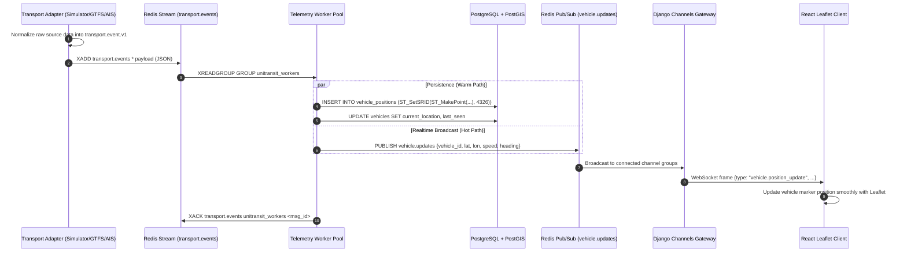

# UniTransit Real-Time Data Flow & Message Pipeline

## 1. End-to-End Telemetry Lifecycle

---

## 2. Ingestion Guarantees & Error Handling

- **At-least-once delivery**: Workers acknowledge processed stream items with `XACK`. Unacknowledged messages are reclaimed via `XAUTOCLAIM` if a worker crashes.
- **Deduplication**: `event_id` or `(vehicle_id, timestamp)` acts as the idempotency key in the PostGIS storage layer.
- **Backpressure**: Redis stream maximum length (`MAXLEN ~ 50000`) prevents memory exhaustion during subscriber downtime.
